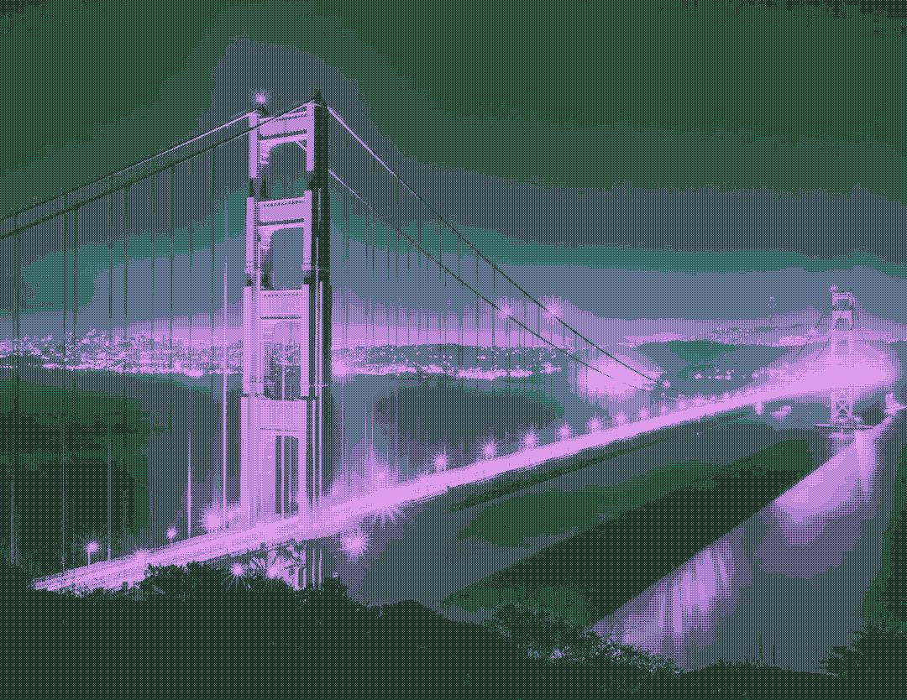

# Pixel Dithering Algorithms

## Description



Dithering is an older technique to provide detail to a image by intentionally applying
some form of "noise." There are many different forms of dithering (and they are not even
exclusive to images - some older lossy formats of audio recordings use them). This simple
python script will provide some dithering algorithms, like Bayer and random noise dithering,
usually applied to monochromatic images
(maybe I will figure out some color pallete techniques later to make the images more
interesting)

## Running the Project

The project's main dependency is the [Pillow](https://pillow.readthedocs.io/en/stable/) library, 
which needs to be installed using pip or conda--depending on what package manager you use for your python environment.

The project contains a makefile. To run the project, simply type the command:

```sh
make run
```

**NOTE:** A didn't come up with a good user interface yet, so you'll just have to read the code
and the call the methods you would like to use.
